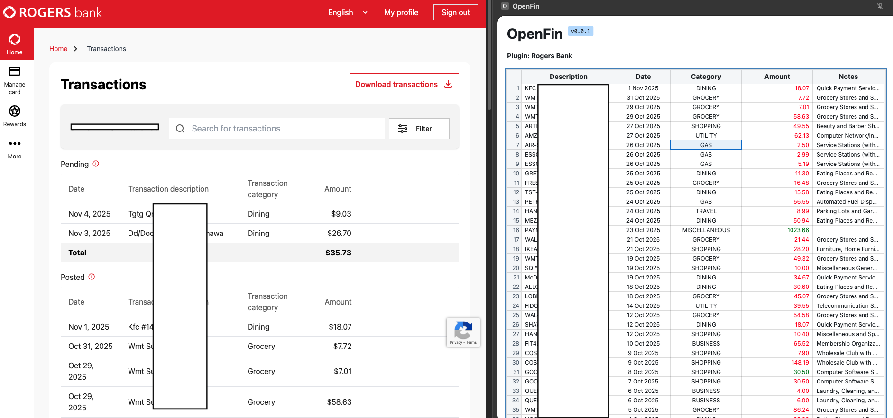
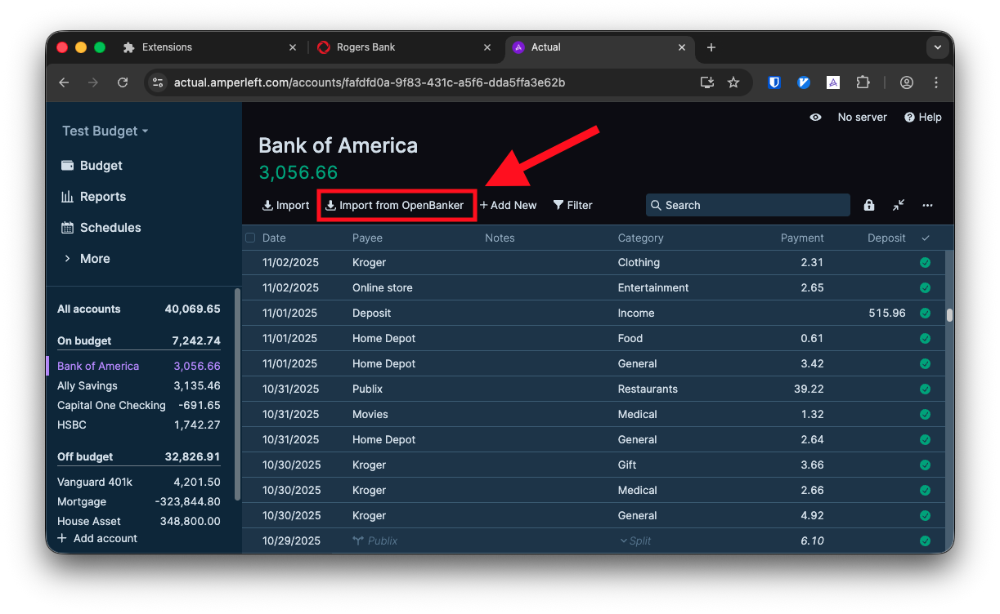
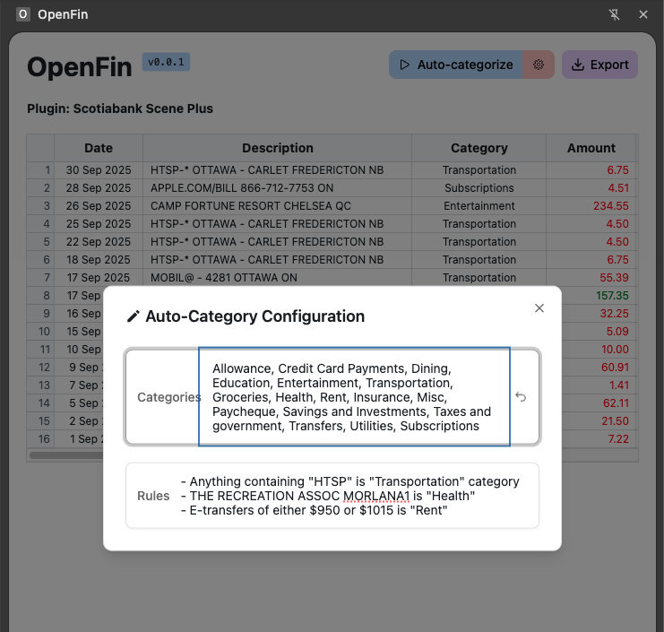

# OpenBanker – Finance Data Importer

A local-first browser extension that captures transactions from online banking sessions and exports them to CSV or [ActualBudget](https://actualbudget.org/).

Self-host your financial data! Nobody else needs access to your banking information.

## 🔗 Supported banks

- **Royal Bank of Canada (RBC)**: Chequing
- **Scotiabank**: Chequing, Credit Card
- **Wealthsimple**: Chequing
- **Rogers Bank**: Credit Card

## ⭐ Key Features

### Export

OpenBanker can export to CSV (*which can be imported into budgeting apps like [ActualBudget](https://actualbudget.org/) or [Firefly III](https://www.firefly-iii.org/)*).

Additionally, this [fork of ActualBudget](https://github.com/voidranjer/actual) includes an "Import from OpenBanker" feature which directly imports from the plugin (no downloading required). Check out the live demo [here](https://actual.amperleft.com).

ActualBudget automatically detects duplicates, execute rules, and more.

### Natural Language Rules

Write rules in plain English.

 - **✅ E-transfers of between $950 and $1015 is "Rent".**

- ❌ `IF name.contains("E-transfer") AND (950 <= amount <= 1015) THEN category = "Rent"`.

## 🗺️ Roadmap

- CI/CD for automating tagged builds
- Unit testing
- Mock transaction data for Vite dev server mode
- Mock 'chrome' API with localStorage. Using dynamic imports, inject mocks only in dev (don't pollute prod)
- All 'window.postMessage' calls in bridge should verify origin of message before replying

## ⌨️ Developer

### Bundler configuration

[Notes on Vite/Rollup config here]

### Running in the Vite development server

`background.ts` contains code for a service worker that runs in the background. If your work does not involve this service worker, you can run the frontend only (with HMR) by launching the Vite dev server using `npm run dev`.

Some functionality requiring the `chrome` API that only exists within the context of a Chrome extension environment will not work. `chrome.storage` is an example of this.

Search for feature guards like `getChromeContext() !== 'extension'` across the codebase.

## 👏 Acknowledgements

- [CWZMorro](https://github.com/CWZMorro) for creating the RBC plugin
