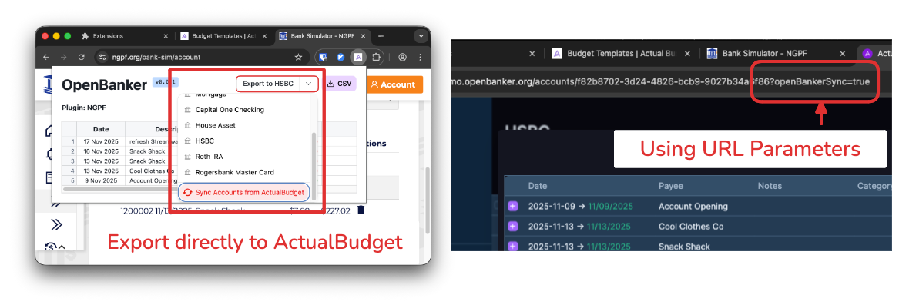

# OpenBanker – Finance Data Importer

A local-first browser extension that captures transactions from online banking sessions and exports them to CSV or [ActualBudget](https://actualbudget.org/).

Self-host your financial data! Nobody else needs access to your banking information.

## 🔗 Supported banks

**🚨 IMPORTANT: The goal is to enable anyone to write their own modules for any bank with basic Javascript and minimal effort.**

> See [this page on making your own bank module](docs/PLUGINS.md).

These are some banks that are officially supported by the maintainers.

- **Royal Bank of Canada (RBC)**: Chequing
- **Scotiabank**: Chequing, Credit Card
- **Wealthsimple**: Chequing
- **Rogers Bank**: Credit Card
- **[NGPF Bank Simulator](https://www.ngpf.org/bank-sim/account)**: Demo website that works out the box. No login required.

## ⭐ Key Features

### Export to CSV

OpenBanker can export to CSV files. Columns are formatted specifically to be a one-click upload to [ActualBudget](https://actualbudget.org/), no field-mapping required.

### Export to ActualBudget

This [fork of ActualBudget](https://github.com/voidranjer/actual) is customized to communicate directly with OpenBanker.

Using this fork, you can import transactions directly into ActualBudget without downloading and uploading CSV files, which is convenient for high-frequency import workflows.

**You can check out the deployed version of this fork, running in "Local Browser Mode" here: [🔗 demo.openbanker.org](https://demo.openbanker.org).**

> If you prefer to self-host [the OpenBanker fork of ActualBudget](https://github.com/voidranjer/actual), you can clone the fork and build it just like you would with ActualBudget. Then, follow [these special build steps](docs/ACTUAL.md) to configure the OpenBanker browser extension to use the URL where your custom ActualBudget fork is running.

## 📦 Installation

While we work on getting OpenBanker published to the Firefox and Chrome Web Store, you must build this project to install it, for now.

> Only Chrome (and Chrome-based browsers like Edge, Brave, Opera, Vivaldi) is supported. We are working on a Firefox port.

1. Install the build dependencies: [Node.js](https://nodejs.org/en/download), [bun](https://bun.com/docs/installation).

2. From the **root** directory, run `bun install` (`npm i` is likely to work too, but is untested).

3. Run `npm run build` from the root directory.

4. Load the generated folder at "packages/chrome/dist" as an unpacked extension, following [these instructions](https://developer.chrome.com/docs/extensions/get-started/tutorial/hello-world#load-unpacked).

5. [Write your own bank module](/docs/PLUGINS.md), rebuild the project, and reload the extension in the browser.

## 🗺️ Roadmap

See [ROADMAP.md](/docs/ROADMAP.md).

## ⌨️ Developer

### Bundler configuration

[Notes on Vite/Rollup config here]

### Running in the Vite development server

`background.ts` contains code for a service worker that runs in the background. If your work does not involve this service worker, you can run the frontend only (with HMR) by launching the Vite dev server using `npm run dev`.

Some functionality requiring the `chrome` API that only exists within the context of a Chrome extension environment will not work. `chrome.storage` is an example of this.

Search for feature guards like `getChromeContext() !== 'extension'` across the codebase.

## 👏 Acknowledgements

- [CWZMorro](https://github.com/CWZMorro) for creating the RBC plugin
